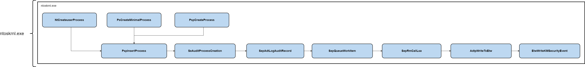

# Windows APIs To Microsoft-Windows-Security-Auditing events

This repository is meant to map API calls to Window Security Event ID's to help defenders know where telemetry is coming from. Version 1 only exposes 37 events coming from the following sub-categories: 

* Audit Logon
* Audit Logoff
* Audit File System 
* Audit Kernel Object
* Audit Registry
* Audit Removable Storage
* Audit Directory Service Access
* Audit SAM
* Audit Special Logon
* Audit Sensitive Privilege Use
* Audit Non Sensitive Privilege Use
* Audit Process Creation
* Audit Process Termination
* Audit Handle Manipulation
* Audit Security System Extension
* Audit Other Object Access Events
* Audit Computer Account Management
* Audit Other Object Access Events
* Audit Kerberos Authentication Service
* Audit Kerberos Service Ticket Operations
* Audit User Account Management
* Audit Detailed File Share
* Other System Events

### API mapping sheet:

[Microsoft-Windows-Security-Auditing Mapping Google Sheet](https://docs.google.com/spreadsheets/d/1d7hPRktxzYWmYtfLFaU_vMBKX2z98bci0fssTYyofdo/edit?usp=sharing)

### Research Notes:
There are 3 function types exposed in this project: 
1. Operational Functions - Functions that are performing an operation that Microsoft has embedded an Event Processing Function in.
2. Event Processing Functions - Undocumented Microsoft functions used to start the event auditing process.
3. Event Emmission Function - Either `ntdll!EtwWriteUMSecurityEvent` or `nt!EtwWriteKMSecurityEvent` which will start the process of writing events to the `Microsoft-Windows-Security-Auditing` ETW Provider. 

#### Event ID 4688:

#### API Mapping Images:
These images can be found in within the `Images` directory. To see images, open from `draw.io` or install the [DrawIO Integration](https://marketplace.visualstudio.com/items?itemName=hediet.vscode-drawio) in VSCode.

## Comments:
### Credit:
A big thanks and credit goes out to the following individuals for the help and insight they had on this project:

* [Matt Graeber](https://twitter.com/mattifestation) - Initially identifying `ntdll!EtwWriteUMSecurityEvent` when I started this project, along being reviewer for this project.
* [Matt Hand](https://twitter.com/matterpreter) - Helping me understand the telemetry collection process for various situations (ETW, Drivers, etc).
* [Roberto Rodriguez](https://twitter.com/Cyb3rWard0g) - Reviewing this project
* [Jared Atkinson](https://twitter.com/jaredcatkinson) - Reviewing this project

### Feedback:
Feedback or thoughts are always welcome! 

### To Do: 
- [ ] Look into more use-cases for Event ID 4662, event is not fully complete. 
- [ ] Scope V2 Events
