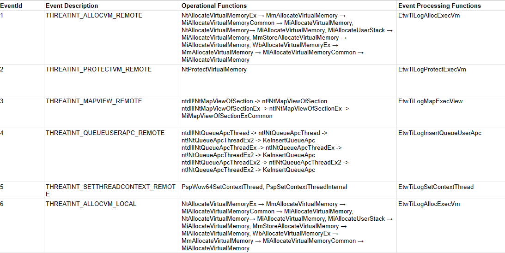

# Windows APIs To Microsoft-Windows-Threat-Intelligence events

Project currently supports the following events:  

* THREATINT_ALLOCVM_REMOTE
* THREATINT_PROTECTVM_REMOTE
* THREATINT_MAPVIEW_REMOTE
* THREATINT_QUEUEUSERAPC_REMOTE
* THREATINT_SETTHREADCONTEXT_REMOTE
* THREATINT_ALLOCVM_LOCAL
* THREATINT_PROTECTVM_LOCAL
* THREATINT_MAPVIEW_LOCAL
* THREATINT_READVM_LOCAL
* THREATINT_WRITEVM_LOCAL
* THREATINT_READVM_REMOTE
* THREATINT_WRITEVM_REMOTE
* THREATINT_SUSPEND_THREAD
* THREATINT_RESUME_THREAD
* THREATINT_SUSPEND_PROCESS
* THREATINT_RESUME_PROCESS
* THREATINT_FREEZE_PROCESS
* THREATINT_THAW_PROCESS
* THREATINT_ALLOCVM_REMOTE_KERNEL_CALLER
* THREATINT_PROTECTVM_REMOTE_KERNEL_CALLER
* THREATINT_MAPVIEW_REMOTE_KERNEL_CALLER
* THREATINT_QUEUEUSERAPC_REMOTE_KERNEL_CALLER
* THREATINT_SETTHREADCONTEXT_REMOTE_KERNEL_CALLER
* THREATINT_ALLOCVM_LOCAL_KERNEL_CALLER
* THREATINT_PROTECTVM_LOCAL_KERNEL_CALLER
* THREATINT_MAPVIEW_LOCAL_KERNEL_CALLER
* THREATINT_DRIVER_OBJECT_LOAD
* THREATINT_DRIVER_OBJECT_UNLOAD
* THREATINT_DEVICE_OBJECT_LOAD
* THREATINT_DEVICE_OBJECT_UNLOAD

### API mapping sheet:

[Microsoft-Windows-Threat-Intelligence Mapping Google Sheet](https://docs.google.com/spreadsheets/d/1d7hPRktxzYWmYtfLFaU_vMBKX2z98bci0fssTYyofdo/edit?usp=sharing)

### Research Notes:
There are 3 function types exposed in this project: 
1. Operational Functions - Functions that are performing an operation that Microsoft has embedded an Event Processing Function in.
2. Event Processing Functions - Undocumented Microsoft functions used to start the event auditing process.
3. Event Emmission Function - For the `Microsoft-Windows-Threat-Intelligence` provider this will be `nt!EtwWrite`.

#### API Mapping Images:
These images can be found in within the `Images` directory. None have been created yet.

## Comments:

## Feedback:
Feedback or thoughts are always welcome! 
