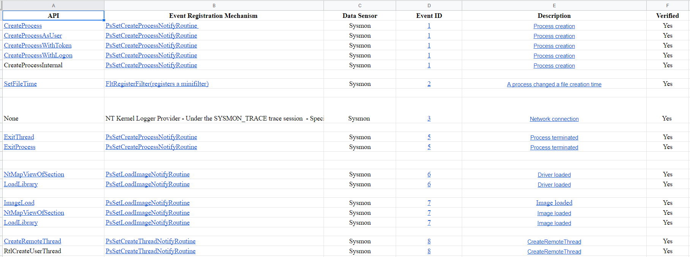
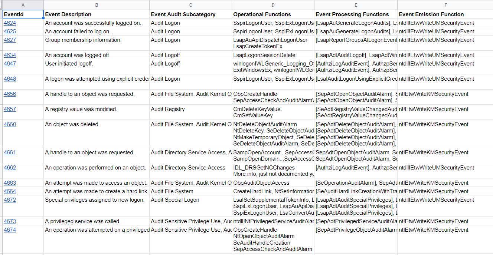

# TelemetrySource
 Project created to map functions repsonsible for triggering events from various telemetry sources. 

## Currently mapped sources: 
### Sysmon 
  
### Window Security Events (Microsoft-Windows-Security-Auditing)
  

* Each source has it's own README file with the necessary information needed to understand how the mappings work. 

## Feedback: 
If anyone has suggestions on how this data could be exposed differently to better help defenders or any other feedback, please reach out! The goal with this project is to help defenders understand how data is generated, so that we can be more informed in our decisions when leveraging that data. 

## To-Dos: 
* [ ] Update Sysmon to v14
* [ ] Expand events in Microsoft-Windows-Security-Auditing