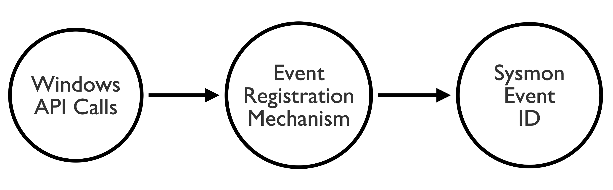

# Windows APIs To Sysmon-Events
A repository that maps API calls to Sysmon Event ID's. 

## API Mapping: 
### Mapping process flow is as follows:

### API mapping sheet:

[API Data Relationships Google Sheet](https://docs.google.com/spreadsheets/d/1T4sm1freM4KJk9Wu8GNxDQDRPur7159kcUji9pk03xU/edit?usp=sharing)

## API Mapping Images:
These images can be found in within the `API-Mapping-Images` directory. 

### Research Notes:
- API(A) - API accepts ASCII character strings. API(W) - API accepts wide character strings. 
- Nt(API) - User mode. Zw(API) called from kernel. If Nt(API) Zw is implied.
- API's listed are ones that were seen within the stack during a breakpoint of the event registration mechanism.

## Comments:
### Credit:
A big thanks and credit goes out to the following individuals for the help and insight they had on this project:

* [Matt Graeber](https://twitter.com/mattifestation) - Guiding me through the Reverse Engineering, with walking me through multiple function calls, and verifying many of these call back functions. 
* [Brian Reitz](https://twitter.com/brian_psu) - Helping me understand function calls and interprocess communication.
* [Jared Atkinson](https://twitter.com/jaredcatkinson) - Helping me understand function calls and interprocess communication. 

### Resources:
* Microsoft Documentation and various function calls and API's. 
* [Subverting Sysmon by Matt Graeber](https://specterops.io/assets/resources/Subverting_Sysmon.pdf)
* [Eveading Sysmon DNS Monitoring](https://blog.xpnsec.com/evading-sysmon-dns-monitoring/)
* [OSSEM Sysmon](https://github.com/hunters-forge/OSSEM/tree/master/data_dictionaries/windows/sysmon)

### Feedback:
Feedback or thoughts are always welcome! 
